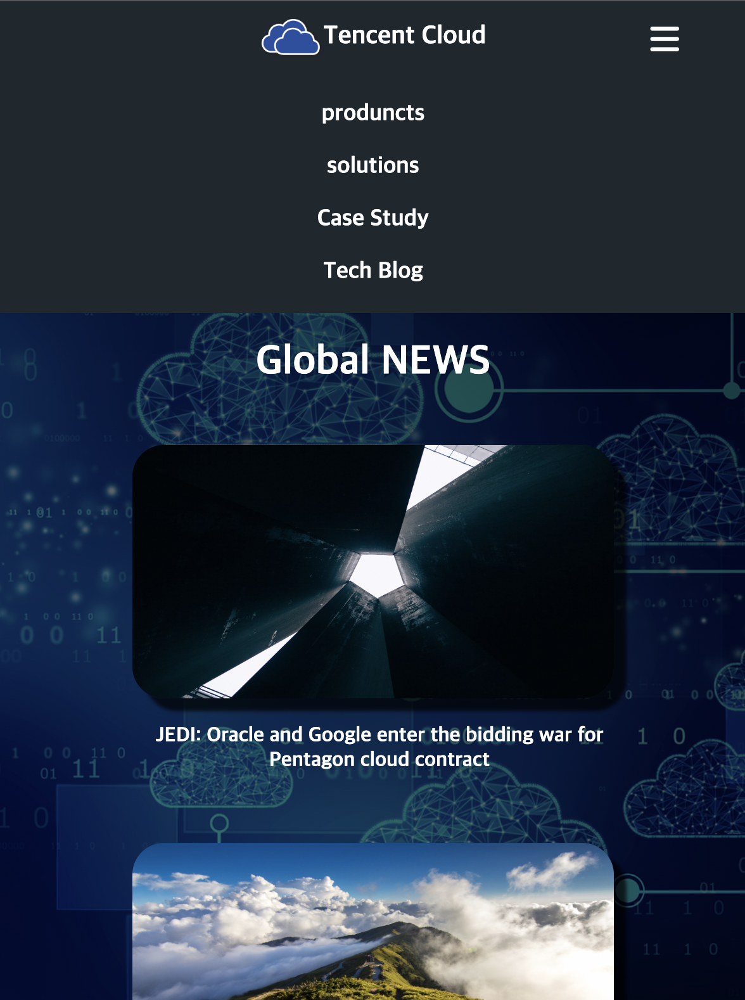

# Responsive-Tencent Cloud

# 🚀 배포
📎 https://spdhsrnvl123.github.io/Tencent-Cloud/

# 🧰 기술 스택 및 구현 사항

</a>
</a>
</a>

## 구현 사항
- 슬라이드
- CSS 애니메이션
- 반응형 웹

## 1. Desktop (over 1024px)

## 2. Tablet (max-width : 1024px)

## 2. mobile (max-width : 768px)

